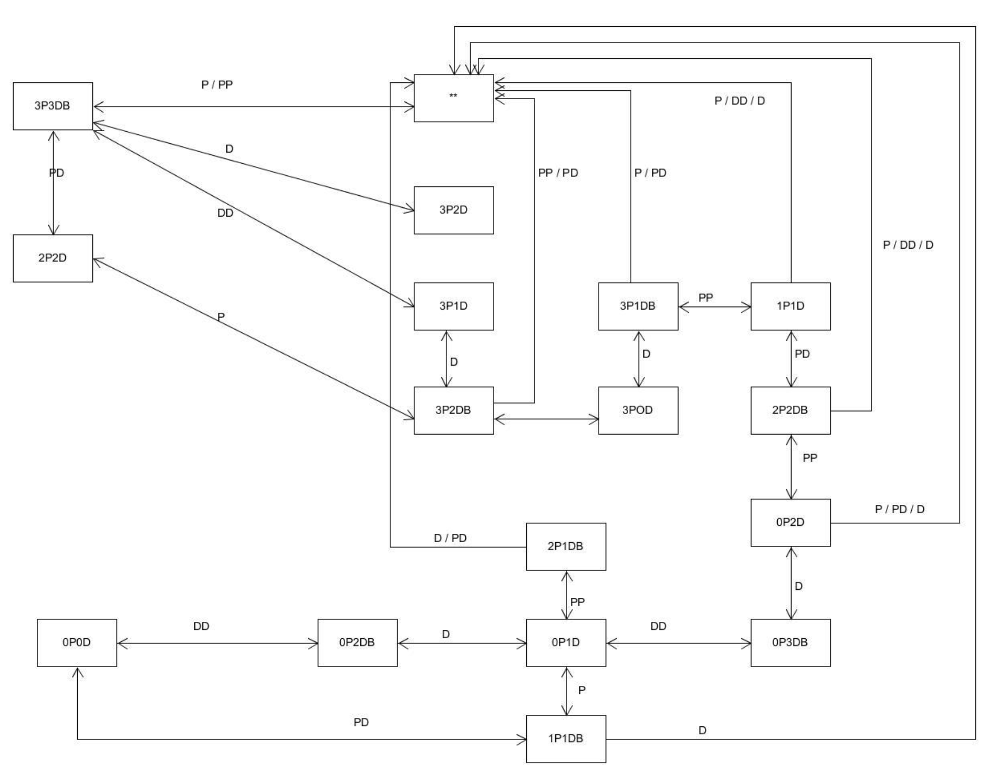

# P&D 过河游戏智能帮助实现

程序具体要求:
- 实现状态图的自动生成
- 讲解图数据在程序中的表示方法
- 利用算法实现下一步的计算

视频展示：https://v.youku.com/v_show/id_XNDQ1ODM2NTY4OA==.html?spm=a2h3j.8428770.3416059.1

牧师过河状态图：


## 搜索算法

我们可以用搜索解决牧师过河问题，可用的搜索算法A*，BFS等。

A*算法的评估函数f(n) = g(n) + h(n)  
g(n)是从初始状态到目前状态的真实消耗，h(n)是从当前状态到目标状态的估计消耗。  

令h(n) = 0就是BFS了。   
在这个问题中，我们认为相邻状态的消耗为1，所以BFS算出到目标状态的最短路径，并且在3牧师3恶魔中，BFS速度很快，所以我选择BFS算法。

状态表示：  
States (P, D, B)  
- P – 在右岸的priests数量
- D – 在右岸的devils数量
- B = 1 表示船在右岸

状态转移：  
Actions (P, D) 
- P – P个priests上船
- D – D个devils上船
- 满足约束的情况下转入下一个状态


State(P, D, 1) => Actions(p, d) => (P-p, D-d, 0)  

State(P, D, 0) => Actions(p, d) => (P+p, D+d, 1)

这样我们就得到了状态的数据结构。
Node表示一个节点，`int priest, evil`和`bool boat`表示States(P, D, B)

`public bool action(int p, int d)`是状态转移函数。代码如下所示。

```cs
public class Node
{

    // number of priests at right bank
    public int priest;

    // number of devils at right bank
    public int devil;

    // true if boat is at right bank
    public bool boat;

    public int priestSum;
    public int devilSum;
    public Node parent;

    public Node(int p, int d, bool b, int pSum, int dSum){
        this.priest = p;
        this.devil = d;
        this.boat = b;
        this.priestSum = pSum;
        this.devilSum = dSum;
        this.parent=null;
    }
    public Node(Node n)
    {
        this.priest = n.priest;
        this.devil = n.devil;
        this.boat = n.boat;
        this.priestSum = n.priestSum;
        this.devilSum = n.devilSum;
        this.parent = n.parent;
    }

    public bool action(int p, int d){
        // boat is at right bank
        // Debug.Log(this+"  action: "+p+d);
        Node old = new Node(this);
        if(boat == true)
        {
            int rp = this.priest - p;
            int rd = this.devil - d;

            int lp = this.priestSum - rp;
            int ld = this.devilSum - rd;

            if(!(rp >=0 && rd >=0 && lp >=0 && ld >=0) || (rp!=0 && rp < rd) || (lp!=0&&lp < ld))
                return false;

            this.parent = new Node(this);
            this.priest = rp;
            this.devil = rd;
            this.boat = false;
        }
        // boat is at left bank
        else
        {
            int rp = this.priest + p;
            int rd = this.devil + d;

            int lp = this.priestSum - rp;
            int ld = this.devilSum - rd;

            if(!(rp >=0 && rd >=0 && lp >=0 && ld >=0) || (rp!=0&&rp < rd) || (lp!=0&&lp < ld))
                return false;

            this.parent = new Node(this);
            this.priest += p;
            this.devil += d;
            this.boat =true;
        }
        this.parent = old;
        return true;

    }

    public override string ToString()
    {
        return "right P "+this.priest +"  D "+this.devil +" "+this.boat;
    }
    // override object.Equals
    public override bool Equals(object obj)
    {

        if (obj == null || GetType() != obj.GetType())
        {
            return false;
        }
       
        Node n = (Node)(obj);
        if(n.priest ==this.priest && n.devil == this.devil && n.boat == this.boat)
            return true;
        else
            return false;
    }
    
    // override object.GetHashCode
    public override int GetHashCode()
    {
        int t = 0;
        if(this.boat)
            t = 1; 
        return this.priest*100+this.devil*10 + t;
    }
}
```

接下来就是BFS求解了。

**BFS算法描述**  
1. 将起始节点放入一个open列表中。
2. 如果open列表为空，则搜索失败，问题无解；否则重复以下步骤：  
    a. 访问open列表中的第一个节点v，若v为目标节点，则搜索成功，退出。

    b. 从open列表中删除节点v，放入close列表中。

    c. 将所有与v邻接且未曾被访问的节点放入open列表中。  


具体实现是用两层循环遍历所有可能的Action(p, d)，Action返回true说明是邻接节点，也就是满足牧师大于等于恶魔的约束。在找到目标节点后，通过Node.parent获得路径返回。
```cs
using System.Collections;
using System.Collections.Generic;
using UnityEngine;

public class BFSsolution : ScriptableObject
{
    public List<Node> BFSearch(Node bNode, Node eNode) {

        List<Node> solutionPath = null;
        Queue<Node> exploreList = new Queue<Node>();
        List<Node> visitedList = new List<Node>();
        exploreList.Enqueue(bNode);
        visitedList.Add(bNode);

        Node beginNode = new Node(bNode);
        Node endNode = new Node(eNode);
        Node currentNode = null;

        while(exploreList.Count!=0){
            currentNode = exploreList.Dequeue();
            if(currentNode.Equals(endNode)){
                solutionPath = new List<Node>(); 
                Node pathNode = currentNode;
                while(pathNode != null){
                    // Debug.Log(pathNode);
                    solutionPath.Add(pathNode);
                    pathNode = pathNode.parent;
                }
                Debug.Log("Find");
                break;
            }
            for(int i = 0; i <= 2; i++)
            {
                for(int j = 0; j <= 2; j++)
                {
                    if(i == 0 && j == 0 || i+j > 2)
                    {
                        continue;
                    }
                    Node nextNode = new Node(currentNode);
                    if(nextNode.action(i,j) && !visitedList.Contains(nextNode)){
                        // Debug.Log(nextNode);
                        Node tempNode = new Node(nextNode);
                        visitedList.Add(tempNode);
                        exploreList.Enqueue(tempNode);
                    }
                }
            }
        }
        return solutionPath;
    }
}
```

BFSsolution类由FirstSceneController调用获得solutionPath   
在`ISceneController`增加`void solverMove()`方法，该方法根据solutionPath选择正确的牧师与恶魔上船。
```cs
public void solverMove(){
    Node nextNode = solutionPath[solutionPath.Count - 2];
    currentNode = solutionPath[solutionPath.Count-1];
    Debug.Log("current "+currentNode);
    Debug.Log("next "+nextNode);
    int moveDevil =Mathf.Abs(nextNode.devil - currentNode.devil);
    int movePriest =Mathf.Abs(nextNode.priest - currentNode.priest);
    for(int i = 0; i < priestsList.Count; i++)
    {
        if(currentNode.boat==true)
        {
            if(priestsList[i].GetState() == State.right && movePriest > 0)
            {
                priestsList[i].model.GetComponent<Click>().OnMouseDown();
                movePriest--;

            }
            if(devilsList[i].GetState() == State.right && moveDevil > 0)
            {
                devilsList[i].model.GetComponent<Click>().OnMouseDown();
                moveDevil--;

            }
        }
        else if(currentNode.boat == false)
        {
            if(priestsList[i].GetState() == State.left && movePriest > 0)
            {
                priestsList[i].model.GetComponent<Click>().OnMouseDown();
                movePriest--;
            }
            if(devilsList[i].GetState() == State.left && moveDevil > 0)
            {
                devilsList[i].model.GetComponent<Click>().OnMouseDown();
                moveDevil--;
            }
            
        }
    }
    solutionPath.RemoveAt(solutionPath.Count-1);
}
```

最后在UserGUI中增加一个Button：AI select，点击按钮，调用上面的solverMove，会自动选择正确的牧师与恶魔上船。
```cs
if(GUI.Button (new Rect(Screen.width/2.1f-75, Screen.height/4, 300,70), "AI select",button_style))
        SceneDirector.GetInstance().CSController.solverMove();
```