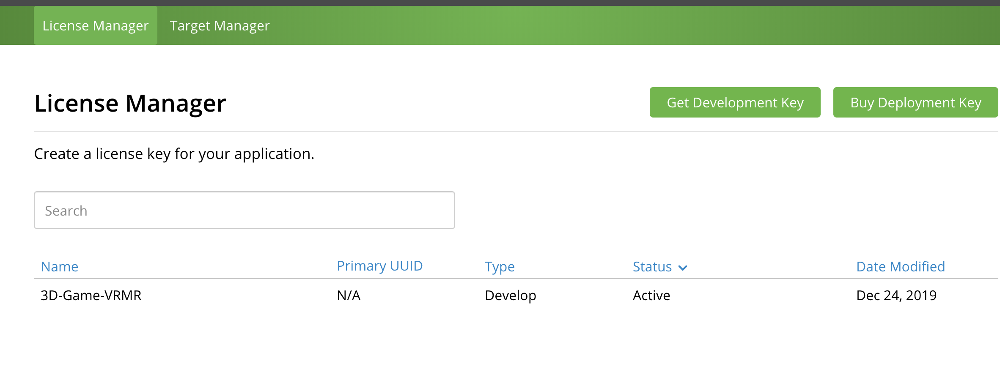
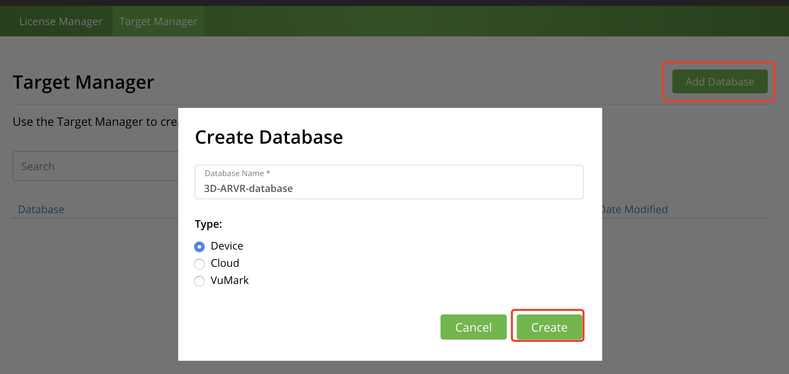
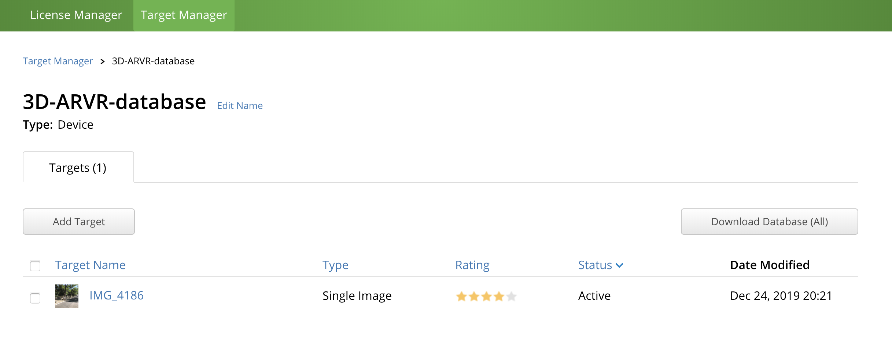
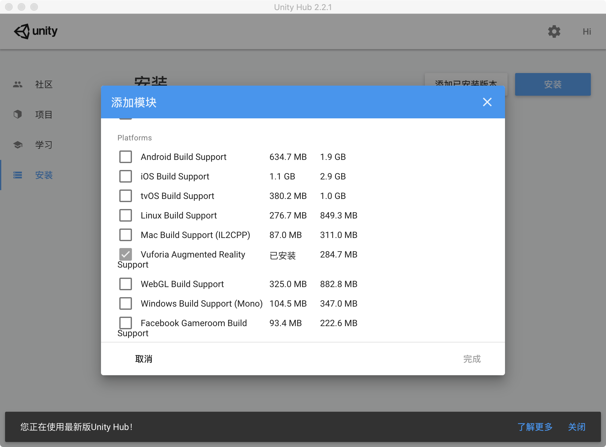
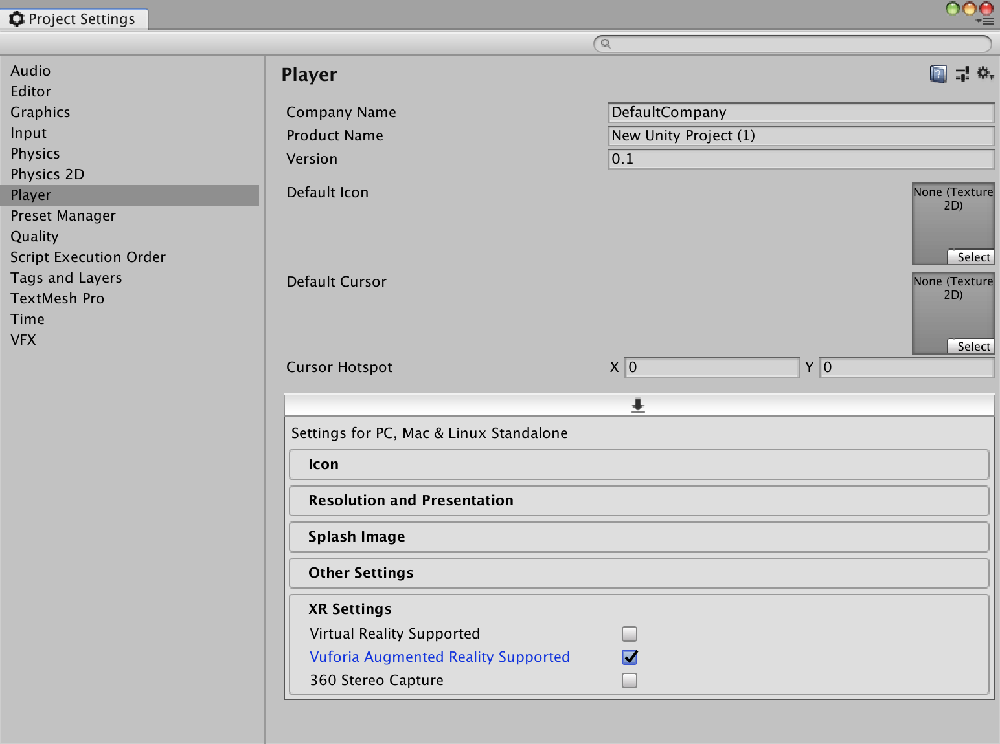
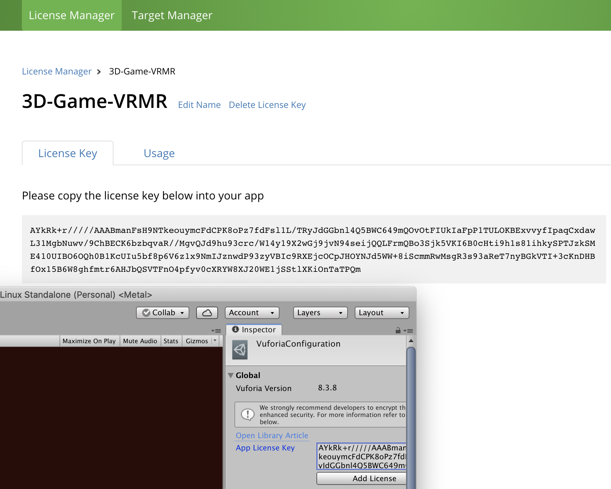
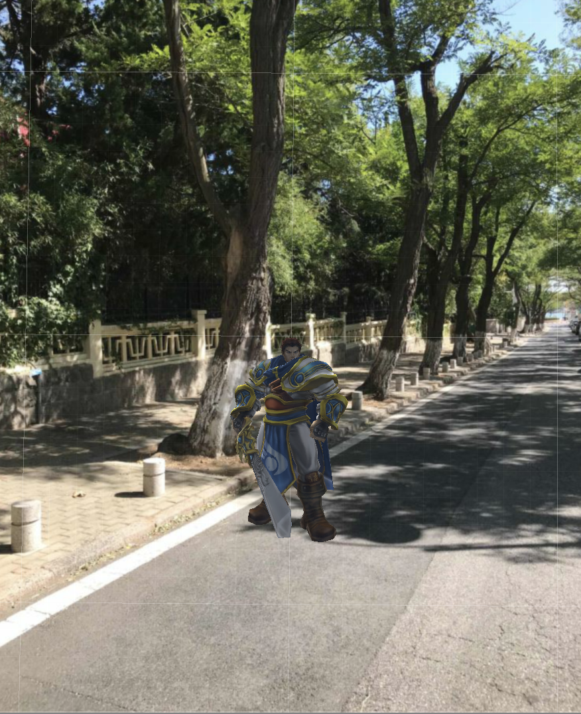
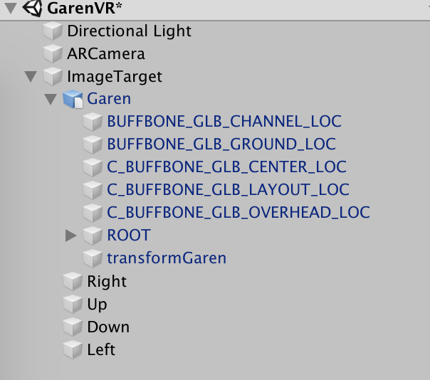

# Unity AR/MR实践

## AR SDK——Vuforia应用

### 实验内容
- 图片识别与建模
- 虚拟按键小游戏

### 实验过程
1. 注册登录(https://developer.vuforia.com/)

2. 创建证书，用于获取License Key。Vuforia在Unity中需要相应的Key对SDK进行配置，否则无法使用.


3. 创建目标数据库,用于对所有Target及其特征数据进行管理和保存.


4. Vuforia要求将特定识别的目标提前上传至数据库进行特征提取。目标有多种类型，此处选择image，以对单幅图像进行识别. 我上传来一张手机照片作为target.


5. 添加Vuforia Argumented Reality模块，然后创建Unity新项目,并在 Edit -> Project Settings -> XRSettings 激活 Vuforia Argumented Reality Support.



6. 导入从Target Manager下载的数据库
7. 删除场景中原有的摄像机，并拖入Vuforia的ARCamera预制体，此时运行项目，可以看到场景为摄像头实景.
8. 从ARCamera的检视面板中打开Vuforia配置文件，将证书管理器中获取的Key写入配置文件同时激活相应数据集.



9. 将准备好的人物Garen拖入场景，作为TargetImage的子对象


10. 添加虚拟按键Up, Down, Right, Left


编写以下脚本，4个虚拟方向键控制Garen移动，将该脚本拖到ImageTarget上。
```cs
using System.Collections;
using System.Collections.Generic;
using UnityEngine;
using Vuforia;
 
public class EventHandler : MonoBehaviour, IVirtualButtonEventHandler
{
    public GameObject Garen;


    void Start()
    {
        VRbehaviours = GetComponentsInChildren<VirtualButtonBehaviour>();
        if(VRbehaviours)
            VRbehaviours[i].RegisterEventHandler(this);

        Garen = GameObject.Find("Garen");
    }

    public void OnButtonPressed(VirtualButtonBehaviour vb)
    {        
        switch (vb.VirtualButtonName)
        {
            case "Up":
                Garen.transform.position += new Vector3(0, 0.01f, 0);
                break;
            case "Down":
                Garen.transform.position -= new Vector3(0, 0.01f, 0);
                break;
            case "Left":
                Garen.transform.position += new Vector3(0.01f, 0, 0);
                break;
            case "Right":
                Garen.transform.position -= new Vector3(0.01f, 0, 0);
                break;    
        }
    }
    

}
```