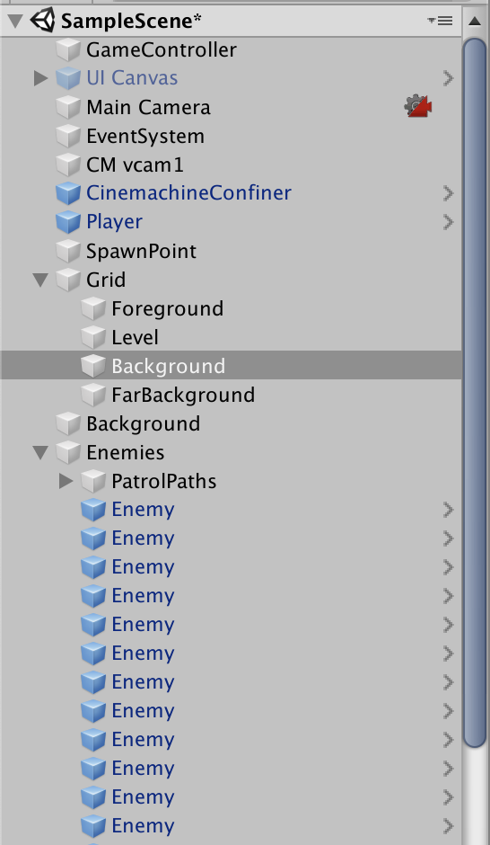
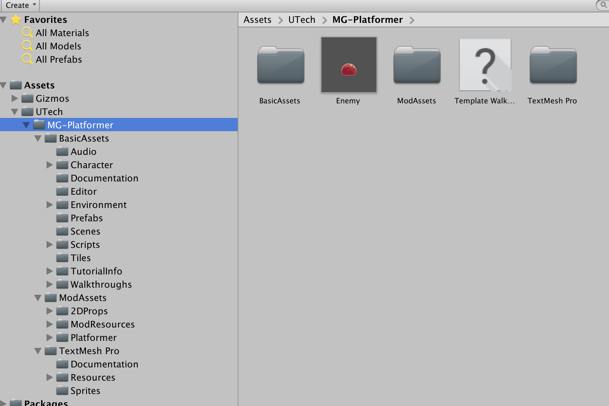
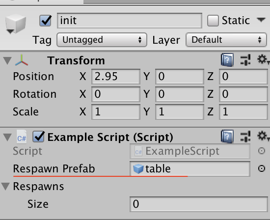
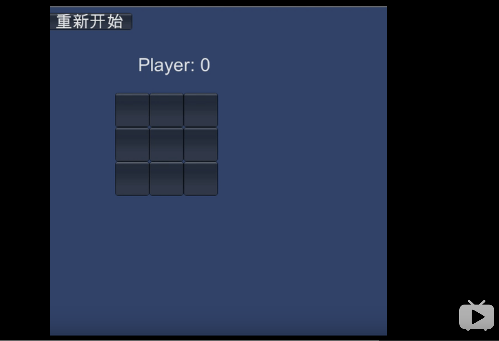
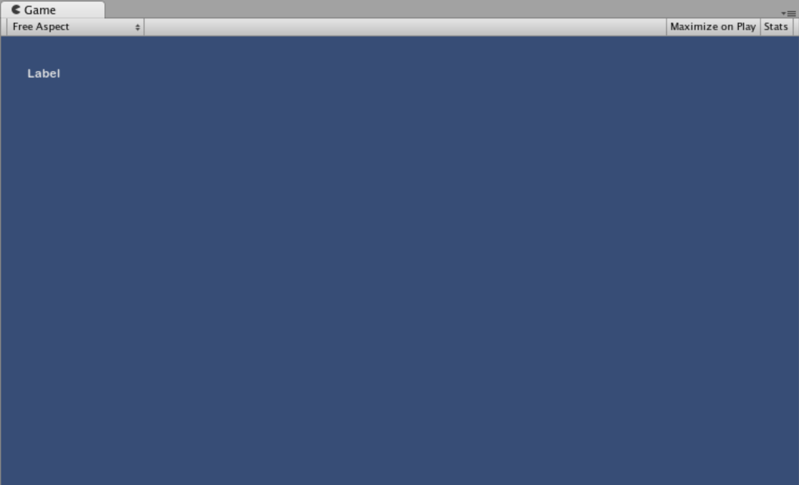
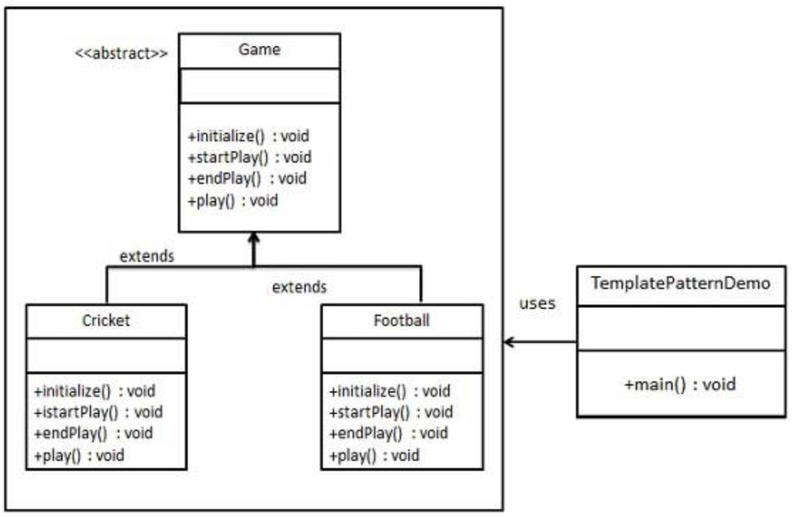
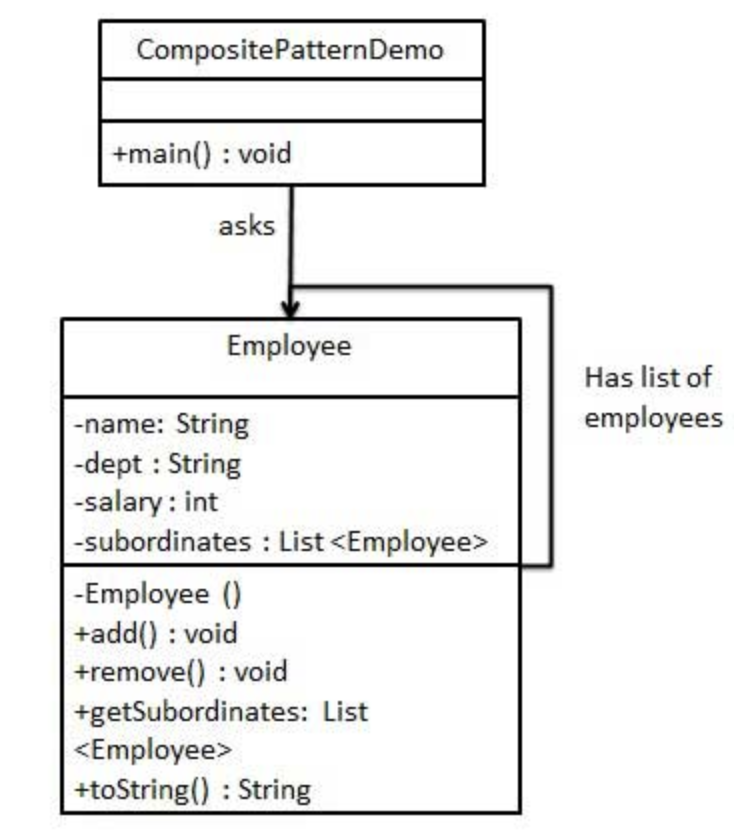

# 离散仿真引擎基础


## 1、简答题


### 1）解释游戏对象（GameObjects）和资源（Assets）的区别与联系  

**游戏对象**是游戏中的实例，最简单的游戏对象比如游戏中的立方体、球体、声音、文字等。  
**资源**是制作游戏过程中用到的脚本文件、游戏对象的模型等。

资源可以实例化游戏对象，也可以为游戏对象添加更改属性。

### 2）下载几个游戏案例，分别总结资源、对象组织的结构（指资源的目录组织结构与游戏对象树的层次结构）

从Unity官网下载学习案例 Micro-Game: platformer  
  
  

### 3）编写一个代码，使用 debug 语句来验证 MonoBehaviour 基本行为或事件触发的条件  

基本行为包括 
-   Awake()   
    在对象加载时调用
-   Start()  
    在Update被第一次调用前的一帧触发
-   Update()   
    所有Start()执行完后被游戏循环调用
-   FixedUpdate()   
    每个游戏循环由物理引擎调用，帧率是固定的
-   LateUpdate()   
    每个游戏循环，在所有Update执行完后被调用

常用事件包括 
- OnGUI() 
用来渲染以及处理GUI事件，每一帧可能多次调用OnGUI
- OnDisable() 
当游戏对象被禁用时调用
- OnEnable()
当游戏对象被启用激活时调用

### 4）查找脚本手册，了解 GameObject，Transform，Component 对象

**GameObject**
Unity场景中所有实体的基类


**Transform**  
物体的位置、旋转和比例。  
场景中的每个对象都有一个Transform。它用于存储和操作对象的位置、旋转和缩放。每个Transform都可以有一个父类，它允许您分层应用位置、旋转和缩放。这是在hierarchy窗格中看到的层次结构。它们还支持枚举器，因此您可以使用以下命令循环遍历子元素:
```cs
using UnityEngine;

public class Example : MonoBehaviour
{
    // Moves all transform children 10 units upwards!
    void Start()
    {
        foreach (Transform child in transform)
        {
            child.position += Vector3.up * 10.0f;
        }
    }
}
```

**Component**  
所有附加到GameObjects的东西的基类。

### 5）整理相关学习资料，编写简单代码验证以下技术的实现

- 查找对象    

- 添加子对象  

- 遍历对象树  

- 清除所有子对象  

```cs
using UnityEngine;
using System.Collections;

public class ExampleScript : MonoBehaviour
{
    public GameObject respawnPrefab;
    public GameObject[] respawns;

    void Start()
    {
        //按标签查找
        respawns = GameObject.FindGameObjectsWithTag("Respawn");

        // 遍历对象
        foreach (GameObject respawn in respawns)
        {
            // 复制对象
            Instantiate(respawnPrefab, respawn.transform.position, respawn.transform.rotation);

        }
      
        //查找对象
        GameObject Cylinder = GameObject.Find("Cylinder");
        //添加子对象
        Cylinder.transform.parent = GameObject.Find("Cube").transform;

    }

    void Update()
    {
        // 销毁对象
        if(Time.time>5)
        foreach(GameObject respawn in respawns)
        {
            GameObject.Destroy(respawn);
        }
    }
}

```

### 6)资源预设（Prefabs）与 对象克隆 (clone)

- 预设（Prefabs）有什么好处？  
组件的集合体，预制物体可以实例化成游戏对象，可以重复的创建具有相同结构的游戏对象。

- 预设与对象克隆(clone or copy or Instantiate of Unity Object)关系？ 

    1、克隆游戏对象需要场景中有被克隆对象，而创建预制只需事先创建预制即可，允许场景中一开始并不存在该游戏对象。

    2、克隆出来的游戏对象并不会随着被克隆体的变化而发生变化，但是使用预制创建出来的对象会随着预制的改变而发生改变。


- 制作 table 预制，写一段代码将 table 预制资源实例化成游戏对象
    
    
    ```cs       
    foreach (GameObject respawn in respawns)
    {
        Instantiate(respawnPrefab, respawn.transform.position,respawn.transform.rotation);

    }
    ```


## 2、井字棋(tic tac toe)小游戏

规则：两人轮流在印有九格方盘上划“+”或“O”字, 谁先把三个同一记号排成横线、直线、斜线, 即是胜者。


[](https://www.bilibili.com/video/av67575194)

参考官方文档，学习[IMGUI](https://docs.unity3d.com/Manual/GUIScriptingGuide.html)用法。

使用label表示棋盘
```cs
    /* GUI.Label example */

    using UnityEngine;
    using System.Collections;

    public class GUITest : MonoBehaviour 
    {
                        
        void OnGUI () 
        {
            GUI.Label (new Rect (25, 25, 100, 30), "Label");
        }

    }
```
效果如下


工程文件在[这里](https://github.com/HiXinJ/3D-Game/tree/master/1-离散仿真引擎基础/TicTacToe)  
附上核心代码。
```cs
using System.Collections;
using System.Collections.Generic;
using UnityEngine;

public class TicTacToe : MonoBehaviour
{
	
	private int[,] board = new int[3, 3];
	private string[]result=new string[3]{"平局","X获胜","O获胜"};
	private int turns = 0;//odd:X, even:O
	private int winner = -1;	//-1:gaming  0:tie  1: x wins  2: O wins 
	private int width = 60;
	// Use this for initialization

	void Start ()
	{
		turns = 0;
		winner = -1;
		for (int i = 0; i < 3; i++)
			for (int j = 0; j < 3; j++)
				board [i, j] = 0;
	}
	
	// Update is called once per frame
	void Update ()
	{
	}

	void OnGUI ()
	{
		//Set the GUIStyle style to be label
        GUIStyle style = GUI.skin.GetStyle ("label");
        style.fontSize =32;
        

		winner = Judge ();
		if (winner != -1)
			GUI.Label (new Rect (160, 80,150, 50), result[winner]);
	
		
		DrawChessBoard ();
		if (winner == -1) {
			if (turns % 2 == 1)
				GUI.Label (new Rect (160, 80, 150, 50), "Player: X");
			else
				GUI.Label (new Rect (160, 80, 150, 50), "Player: 0");
		}
		if (GUI.Button (new Rect (0, 10, 150, 30), "重新开始"))
			Start ();
	}

	private bool DrawChessBoard ()
	{
		GUIStyle style = GUI.skin.GetStyle ("button");
        style.fontSize =30;
        
		for (int i = 0; i < 3; i++)
			for (int j = 0; j < 3; j++) {
				if (board [i, j] == 1) {
					GUI.Button (new Rect (120 + i * width, 150 + j * width, width, width), "X");
				} else if (board [i, j] == 2) {
					GUI.Button (new Rect (120 + i * width, 150 + j * width, width, width), "O");
				} else if (GUI.Button (new Rect (120 + i * width, 150 + j * width, width, width), "")) {
					if (winner != -1)
						continue;
					else if (turns % 2 == 1) {
						board [i, j] = 1;
						turns++;
					} else if (turns % 2 == 0) {
						board [i, j] = 2;
						turns++;
					}
				}
			}
		return true;
	}

	private int Judge ()
	{

		if (board[0,0] != 0 && board [0, 0] == board [1, 1] && board [2, 2] == board [1, 1])
			return board [0, 0];
		
		if (board[0,2] != 0 && board [0, 2] == board [1, 1] && board [2, 0] == board [1, 1])
			return board [0, 2];
		
		for (int i = 0; i < 3; i++)
			if (board[i,0] != 0 && board [i, 0] == board [i, 1] && board [i, 2] == board [i, 1])
				return board [i, 0];
		
		for (int i = 0; i < 3; i++)
			if (board[0,i] != 0 && board [0, i] == board [1, i] && board [2, i] == board [1, i])
				return board [0, i];
		
		if (turns == 9)
			return 0;
		return -1;
	}
}
```


## 3、思考题

- 微软 XNA 引擎的 Game 对象屏蔽了游戏循环的细节，并使用一组虚方法让继承者完成它们，我们称这种设计为“模板方法模式”。
    - 为什么是“模板方法”模式而不是“策略模式”呢？  
    模板方法定义了一个操作中算法的骨架，将一些步骤推迟到子类中实现，可以不改变算法的结构而重新定义该算法的步骤。  
    在XNA引擎中，我们可以在子类中实现Update方法。
    

- 将游戏对象组成树型结构，每个节点都是游戏对象（或数）。
    - 尝试解释组合模式（Composite Pattern / 一种设计模式）。   
    
    **意图**：将对象组合成树形结构以表示"部分-整体"的层次结构。组合模式使得用户对单个对象和组合对象的使用具有一致性。  
    **主要解决**：它在我们树型结构的问题中，模糊了简单元素和复杂元素的概念，客户程序可以像处理简单元素一样来处理复杂元素，从而使得客户程序与复杂元素的内部结构解耦。  


    - 使用 BroadcastMessage() 方法，向子对象发送消息。你能写出 BroadcastMessage() 的伪代码吗?
    ```cs
    public void BroadcastMessage(string methodName, object parameter = null, SendMessageOptions options = SendMessageOptions.RequireReceiver){
        method = to_Function(methodName);
        SendMessageOptions.RequireReceiver->method(parameter);
    }
    ```


- 一个游戏对象用许多部件描述不同方面的特征。我们设计坦克（Tank）游戏对象不是继承于GameObject对象，而是 GameObject 添加一组行为部件（Component）。
    - 这是什么设计模式？  
    装饰者模式
    - 为什么不用继承设计特殊的游戏对象？
    如果继承GameObject会产生很长的继承链，系统的耦合性会变强。
    


