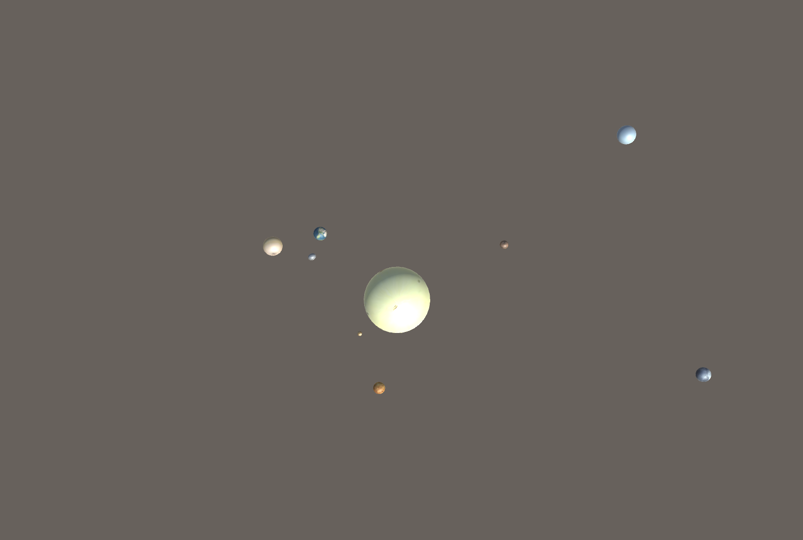
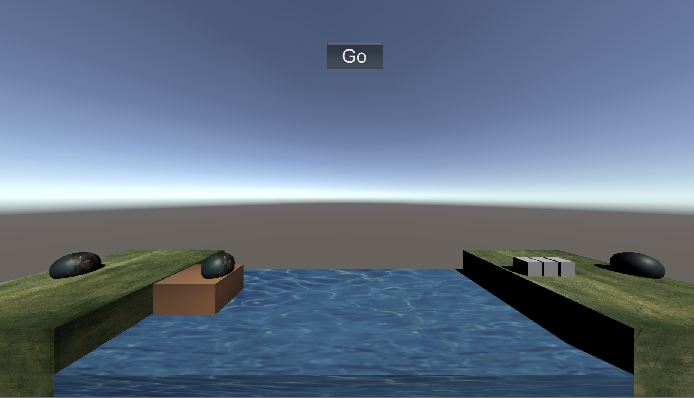
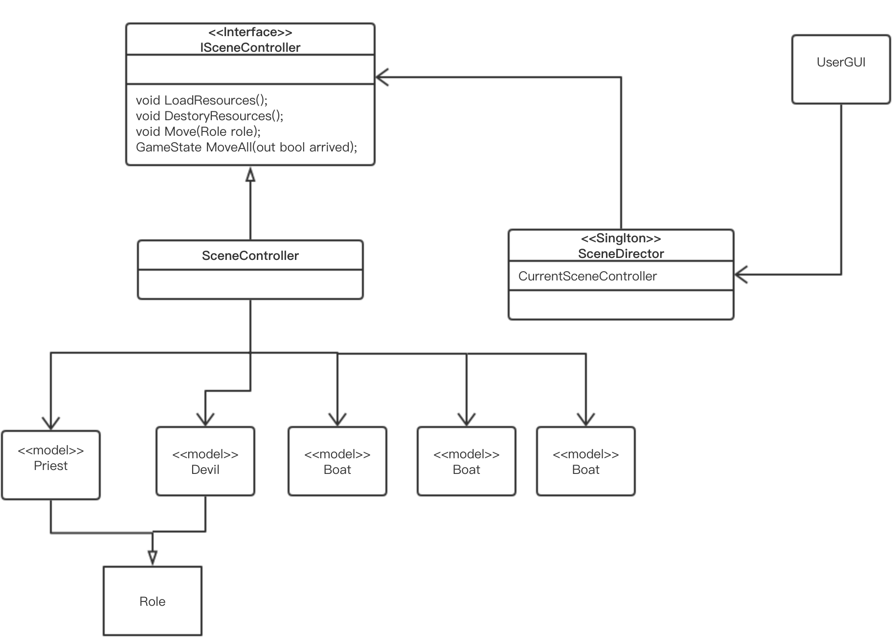
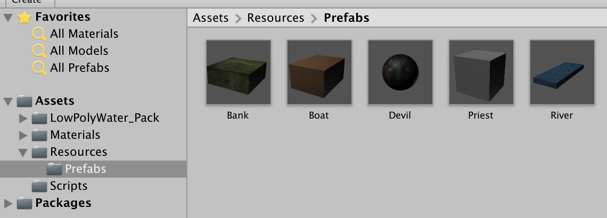
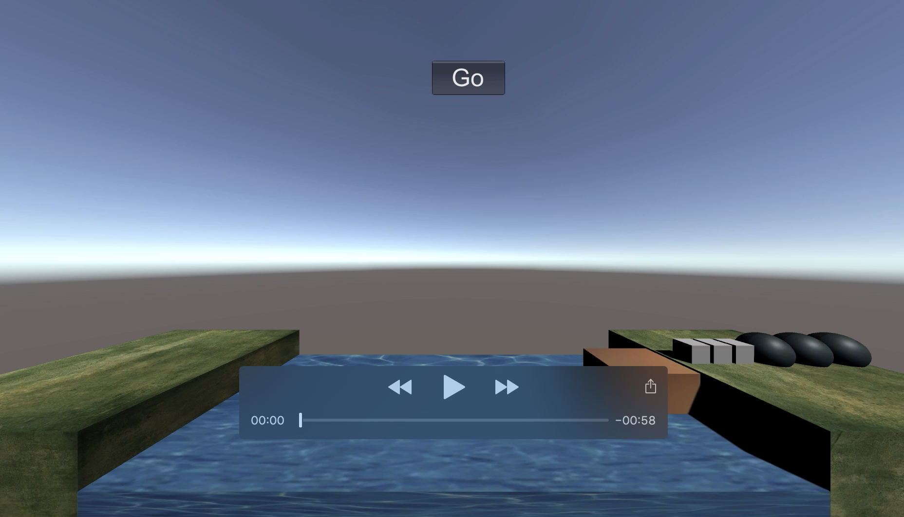

# 空间与运动

## 1、简答并用程序验证【建议做】

### 游戏对象运动的本质是什么？

每一帧游戏对象的位置的变化，连续多帧形成视觉上物体的运动。

### 请用三种方法以上方法，实现物体的抛物线运动。（如，修改Transform属性，使用向量Vector3的方法…）

```cs
   //水平与竖直方向叠加
    void projectile1()
    {
        this.transform.position += Vector3.right * 10f * Time.deltaTime;
        this.transform.position += Vector3.down * 9.8f * Time.time * Time.deltaTime;
    }

    //同时改变x,y坐标
    void projectile2()
    {
        this.transform.position += new Vector3(10f * Time.deltaTime, -9.8f * Time.time * Time.deltaTime, 0);
    }

    //使用Translate
    void projectile3()
    {
        this.transform.Translate(new Vector3(10f * Time.deltaTime, -9.8f * Time.time * Time.deltaTime, 0));
    }
```


### 写一个程序，实现一个完整的太阳系， 其他星球围绕太阳的转速必须不一样，且不在一个法平面上。



自转：  
```cs
public void Rotate(Vector3 eulers, Space relativeTo = Space.Self);
```
Parameters

  - eulers	The rotation to apply.
  - relativeTo	Determines whether to rotate the GameObject either locally to the GameObject or relative to the Scene in world space.


公转：  
```cs
// Rotates the transform about axis passing through point in world coordinates by angle degrees.
public void RotateAround(Vector3 point, Vector3 axis, float angle);
```

```cs
using System.Collections;
using System.Collections.Generic;
using UnityEngine;

public class SolorSystem : MonoBehaviour
{
    Vector3 sun;
    // Start is called before the first frame update
    void Start()
    {
        sun = Vector3.zero;
    }

    // Update is called once per frame
    void Update()
    {
        GameObject.Find("Mercury").transform.RotateAround(sun, new Vector3(0, 1, 0.2f), 30 * Time.deltaTime);
        GameObject.Find("Mercury").transform.Rotate(Vector3.up * Time.deltaTime * 1080);

        GameObject.Find("Venus").transform.RotateAround(sun, new Vector3(0, 1, 0.1f), 25 * Time.deltaTime);
        GameObject.Find("Venus").transform.Rotate(Vector3.up * Time.deltaTime * 300);

        GameObject.Find("Earth").transform.RotateAround(sun, new Vector3(0, 1, 0), 35 * Time.deltaTime);
        GameObject.Find("Earth").transform.Rotate(Vector3.up * Time.deltaTime * 360);
        GameObject.Find("Moon").transform.Rotate(Vector3.up*500*Time.deltaTime);


        GameObject.Find("Mars").transform.RotateAround(sun, new Vector3(0, 1, 0.5f), 50 * Time.deltaTime);
        GameObject.Find("Mars").transform.Rotate(Vector3.up * Time.deltaTime * 360);

        GameObject.Find("Jupiter").transform.RotateAround(sun, new Vector3(0.5f, 1, 0), 35 * Time.deltaTime);
        GameObject.Find("Jupiter").transform.Rotate(Vector3.up * Time.deltaTime * 800);

        GameObject.Find("Saturn").transform.RotateAround(sun, new Vector3(0, 1, 2), 45* Time.deltaTime);
        GameObject.Find("Saturn").transform.Rotate(Vector3.up * Time.deltaTime * 810);

        GameObject.Find("Uranus").transform.RotateAround(sun, new Vector3(0, 1, 0.3f), 50 * Time.deltaTime);
        GameObject.Find("Uranus").transform.Rotate(Vector3.up * Time.deltaTime * 1000);

        GameObject.Find("Neptune").transform.RotateAround(sun, new Vector3(0.1f, 1, 0.2f), 60 * Time.deltaTime);
        GameObject.Find("Neptune").transform.Rotate(Vector3.up * Time.deltaTime * 1000);
    }


}

```


## 2、Priests and Devils 编程实践

- 阅读以下游戏脚本
    
    Priests and Devils

    Priests and Devils is a puzzle game in which you will help the Priests and Devils to cross the river within the time limit. There are 3 priests and 3 devils at one side of the river. They all want to get to the other side of this river, but there is only one boat and this boat can only carry two persons each time. And there must be one person steering the boat from one side to the other side. In the flash game, you can click on them to move them and click the go button to move the boat to the other direction. If the priests are out numbered by the devils on either side of the river, they get killed and the game is over. You can try it in many > ways. Keep all priests alive! Good luck!  



- 游戏中提及的事物（Objects）  
   - Priests
   - devils
   - river
   - boat
   - river bank

  
- 玩家动作表  


    | 动作 | 条件 | 结果|
    |-----|------|----|
    |点击岸边人物|人物与船在同一岸&&船不满|人物上船|
    |点击船上人物|船在岸边|人物下船|
    |点击go按钮|船上有人|船向另一边移动|
    |       

- 类
  - Priest
  - Devil
  - Boats
  - SenceController
  - View

### 游戏架构

游戏使用MVC模式，类图如下所示。
  

### 制作预制

用正方体代表Priest，用球体代表Devil

在脚本中用预制生产对象，例如：

```csharp
GameObject model;
string path = "prefabs/River";
model = Instantiate(Resources.Load(path), position,    Quaternion.identity) as GameObject;
```

### Model

Model有Priest，Devil，Bank，River，Boat
Model基本操作有
- Move，平移游戏对象
- RemoveModel，删除游戏对象
- 相关属性的Get，Set函数


其中Priest和Devil继承Role。  
Role的属性有
- state 对象状态是在左岸、右岸还是船上
- isClicked 用来控制对象被鼠标点击后的行为
- leftBankPos，rightBankPos 对象在岸上的坐标

```cs
//Role
public enum State{left, right, onBoat1, onBoat2, BoatMoving};

public class Role : MonoBehaviour
{
    public GameObject model;
    protected State state;
    public string path;
    public bool isClicked;
    public static bool clickable = true;
    public Vector3 leftBankPos;
    public Vector3 rightBankPos;
    public void Move(Vector3 direction, int speed){
        model.transform.position +=  speed * direction * Time.deltaTime;
        
    }
    public State GetState(){return state;}
    public void SetState(State s){state = s;}
    public void RemoveModel()
    {
        Destroy(model);
    }
}

```
Priest:
```cs
public class Priest : Role
{
    public Priest(Vector3 position){

        rightBankPos = position;
        leftBankPos = new Vector3(-rightBankPos.x, 3.5f, 0);
        path = "Prefabs/Priest";
        state = State.right;
        model = Instantiate(Resources.Load(path), position, Quaternion.identity) as GameObject;   
        Click click =  model.AddComponent(typeof(Click)) as Click;
        isClicked = false;
        click.SetRole(this);
    }
}

```

Devil:

```cs
public class Devil : Role
{
    public Devil(Vector3 position){
        rightBankPos = position;
        leftBankPos = new Vector3(-rightBankPos.x, 3.5f, 0);
        path = "Prefabs/Devil";
        state = State.right;
        model = Instantiate(Resources.Load(path), position, Quaternion.identity) as GameObject;   
        Click click =  model.AddComponent(typeof(Click)) as Click;
        isClicked= false;
        click.SetRole(this);
    }
}
```

Bank、River的职责仅仅是初始化游戏对象以及删除游戏对象。

### SceneDirector导演类单实例模式

其职责大致如下：

- 获取当前游戏的场景
- 控制场景运行、切换、入栈与出栈
- 暂停、恢复、退出
- 管理游戏全局状态
- 设定游戏的配置
- 设定游戏全局视图

在这个游戏中只有一个场景，所以导演类比较简单，代码如下。
```cs
public class SceneDirector : System.Object
{
    private static SceneDirector _instance;             //导演类的实例
    public ISceneController CSController { get; set; }
    public static SceneDirector GetInstance()           
    {

        if (_instance == null)
        {
            _instance = new SceneDirector();
        }
        return _instance;
    }
}
```

### ISceneController接口

[SceneController](Priests-and-Devils/Assets/Scripts/SceneController.cs)实现[ISceneController](Priests-and-Devils/Assets/Scripts/ISceneController.cs)

其职责大致如下：
- 加载与销毁游戏对象
- 在河岸与船之间移动Priest和Devil
- 移动船
- 管理本场次的规则（裁判）

由于它实现了 ISceneController 接口，所以当导演切换场景时，就可以利用多态的特性，让不同场景加载不同资源。

### UserGUI

UserGUI调用SceneDirector提供的功能:
- 显示模型，将人机交互事件交给控制器处理
- 处收 Input 事件
- 渲染 GUI ，接收事件

```cs
using System.Collections;
using System.Collections.Generic;
using UnityEngine;

public class UserGUI : MonoBehaviour
{
    bool clickGo;
    bool arrived;
    GameState gameState;
    ISceneController action;
    // Start is called before the first frame update
    void Start()
    {
        clickGo = false;
        arrived = false;
        gameState = GameState.playing;
        action = SceneDirector.GetInstance().CSController=new SceneController();
        action.LoadResources();
    }

    // Update is called once per frame
    void Update()
    {
        if(clickGo)
            gameState = SceneDirector.GetInstance().CSController.MoveAll(out arrived);
        if(arrived)
            clickGo = false;
    }
    void OnGUI()
    {
        GUIStyle button_style;
        button_style = new GUIStyle("button")
        {
            fontSize = 50
        };

        if(gameState == GameState.playing)
        {    
            if(GUI.Button (new Rect(Screen.width/2.1f, Screen.height/8, 150,70), "Go",button_style))
                clickGo=true;
        }
        else if(gameState == GameState.win)
        {
            if(GUI.Button (new Rect(Screen.width/2.4f, Screen.height/3.5f, 450,170), "You Won \nplay again",button_style))
            {
                clickGo = false;
                arrived = false;
                gameState = GameState.playing;
                action.DestoryResources();
                action.LoadResources();
            }
        }   
        else if(gameState == GameState.defeat)
        {
            if(GUI.Button (new Rect(Screen.width/2.4f, Screen.height/3.5f, 450,170), "You Lost\nplay again",button_style))
            {
                clickGo = false;
                arrived = false;
                gameState = GameState.playing;
                action.DestoryResources();
                action.LoadResources();
            }            
        }
    }
}
```

### 鼠标点击事件
点击Priest或Devil将使其上船或下船。  

创建Click类，将其作为Role的Component：
```cs
Click click =  model.AddComponent(typeof(Click)) as Click;
```
这样点击model（Role）对象时，click.OnMouseDown()就会被调用。

OnMouseDown()是通知Role被点击，然后在Update()中通过SceneDirector调用Move来移动Role对象。
```cs
public class Click : MonoBehaviour
{
    Role role;
    public Role GetRole(){
        return role;
    }

    public void SetRole(Role value){
        role = value;
    }
    public void OnMouseDown()
    {
        if(Role.clickable)
        {
            Role.clickable = false;
            role.isClicked = true;
        }   
    }

    void Update(){
       if(role.isClicked)
            SceneDirector.GetInstance().CSController.Move(role);
    }
}
```

视频展示：
[](https://v.youku.com/v_show/id_XNDM3MDQxODIyOA==.html?spm=a2h3j.8428770.3416059.1)