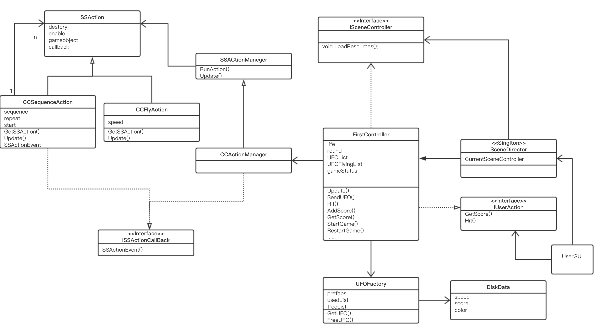

# 简单的鼠标打飞碟（Hit UFO）游戏

- 游戏内容要求：
    1. 游戏有 n 个 round，每个 round 都包括10 次 trial；
    2. 每个 trial 的飞碟的色彩、大小、发射位置、速度、角度、同时出现的个数都可能不同。它们由该 round 的 ruler 控制；
    3. 每个 trial 的飞碟有随机性，总体难度随 round 上升；
    4. 鼠标点中得分，得分规则按色彩、大小、速度不同计算，规则可自由设定。
- 游戏的要求：
    1. 使用带缓存的工厂模式管理不同飞碟的生产与回收，该工厂必须是场景单实例的！具体实现见参考资源 Singleton 模板类；
    2. 近可能使用前面 MVC 结构实现人机交互与游戏模型分离。

[视频链接](https://v.youku.com/v_show/id_XNDM5MjAxMTM3Ng==.html?spm=a2h3j.8428770.3416059.1)

## 一、UML图

该游戏的UML比较复杂，使用了组合模式解决动作管理问题，使用了MVC模式。程序框架虽比较复杂，但是有利于训练面向对象的程序设计能力，使用设计模式能使程序更能适应需求变化，更易于维护，提高代码重用。这次的游戏和之前动作分离版牧师过河游戏相比，很多代码都能重用，主要的不同在于FirstController，被组合动作类CCFlyAction以及UserGUI。  
另外该游戏使用了带缓存的工厂模式管理不同飞碟的生产与回收，因为带缓存的飞碟对象创建比较复杂，所以使用工厂类来管理。



## 二、组合模式的动作实现

动作管理器由SSAction,CCSequenceAction和CCFlyAction三个类的组合模式构成

### **SSAction**

```cs
public class SSAction : ScriptableObject      
{
    public bool enable = true;                      //是否正在进行此动作
    public bool destroy = false;                    //是否需要被销毁

    public GameObject gameobject;                   //动作对象
    public Transform transform;                     
    public ISSActionCallback callback;              

    protected SSAction() { }                        //防止用户自己new对象

    public virtual void Start()
    {
        throw new System.NotImplementedException();
    }

    public virtual void Update()
    {
        throw new System.NotImplementedException();
    }
}
```

### **CCSequenceAction**

```cs
public class CSequenceAtion : SSAction, ISSActionCallback
{
    public List<SSAction> sequence;    //被组合动作对象
    public int repeat = -1;            //-1 无线循环
    public int start = 0;              

    public static CSequenceAtion GetSSAcition(int repeat, int start, List<SSAction> sequence)
    {
        CSequenceAtion action = ScriptableObject.CreateInstance<CSequenceAtion>();
        action.repeat = repeat;
        action.sequence = sequence;
        action.start = start;
        return action;
    }

    public override void Update()
    {
        // Debug.Log("CCSequenceAction Update");
        if (sequence.Count == 0) return;
        if (start < sequence.Count)
        {
            sequence[start].Update();     //一个组合中的一个动作执行完后会调用接口,所以这里看似没有start++实则是在回调接口函数中实现
        }
    }

    public void SSActionEvent(SSAction source, SSActionEventType events = SSActionEventType.Competeted,
        int intParam = 0, string strParam = null, Object objectParam = null)
    {
        Debug.Log("ss event");
        source.destroy = false;          //先保留这个动作，如果是无限循环动作组合之后还需要使用
        this.start++;
        if (this.start >= sequence.Count)
        {
            this.start = 0;
            if (repeat > 0) repeat--;
            if (repeat == 0)
            {
                this.destroy = true;               //整个组合动作就删除
                this.callback.SSActionEvent(this); //告诉组合动作的管理对象组合做完了
            }
        }
    }

    public override void Start()
    {
        foreach (SSAction action in sequence)
        {
            action.gameobject = this.gameobject;
            action.transform = this.transform;
            action.callback = this;                //组合动作的每个小的动作的回调是这个组合动作
            action.Start();
        }
    }

    void OnDestroy()
    {
        //如果组合动作做完第一个动作突然不要它继续做了，那么后面的具体的动作需要被释放
    }
}
```

### **CCFlyAction**  
这是具体动作类，控制物体飞行。要注意什么时候调用回调函数通知管理者动作完成：  
 1. UFO飞出边界
 2. UFO被击落 
```cs
public class CCFlyAction : SSAction {
    Vector3 speed;
 
    public static CCFlyAction GetSSAction(GameObject UFO)
    {
        CCFlyAction action = ScriptableObject.CreateInstance<CCFlyAction>();
        action.speed = UFO.GetComponent<UFOData>().speed;

        return action;
    }
	public override void Start () {
    }
 
    // Update is called once per frame
    public override void Update () {
        if (gameobject.activeSelf)
        {
            transform.position += speed * Time.deltaTime;

            //飞出边界
            if (Mathf.Abs(this.transform.position.x) > 20 ||Mathf.Abs( this.transform.position.y) > 13)
            {
                this.destroy = true;
                //通知动作组合对象
                this.callback.SSActionEvent(this);
            }
        }
        else{
            //被击落
            this.callback.SSActionEvent(this);
        }
	}
}
```

## 三、动作管理器

### SSActionManeger，动作管理基类

```cs
public class SSActionManager : MonoBehaviour, ISSActionCallback                      //action管理器
{

    private Dictionary<int, SSAction> actions = new Dictionary<int, SSAction>();    //将执行的动作的字典集合,int为key，SSAction为value
    private List<SSAction> waitingAdd = new List<SSAction>();                       //等待去执行的动作列表
    private List<int> waitingDelete = new List<int>();                              //等待删除的动作的key                

    public void Update()
    {
        foreach (SSAction ac in waitingAdd)
        {
            actions.Add(ac.GetInstanceID(),ac);                                      //获取动作实例的ID作为key
        }
        waitingAdd.Clear();

        foreach (KeyValuePair<int, SSAction> kv in actions)
        {
            SSAction ac = kv.Value;
            if (ac.destroy)
            {
                waitingDelete.Add(ac.GetInstanceID());
            }
            else if (ac.enable)
            {
                ac.Update();
            }
        }

        foreach (int key in waitingDelete)
        {
            SSAction ac = actions[key];
            actions.Remove(key);
            Object.Destroy(ac);
        }
        waitingDelete.Clear();
    }

    public void RunAction(GameObject gameobject, SSAction action, ISSActionCallback manager)
    {
        action.gameobject = gameobject;
        action.transform = gameobject.transform;
        action.callback = manager;
        waitingAdd.Add(action);
        action.Start();

    }

    public void SSActionEvent(SSAction source, SSActionEventType events = SSActionEventType.Competeted,
        int intParam = 0, string strParam = null, Object objectParam = null)
    {
        // source.callback.SSActionEvent(source);
    }
}
```

### CCActionManager

```cs
public class CCActionManager : SSActionManager
{

    public FirstController sceneController;

    public void Awake(){

        
    }
    protected  void Start()
    {
        sceneController = (FirstController)SceneDirector.GetInstance().CSController;
        sceneController.actionManager = this;
    }

    protected new void Update()
    {
        base.Update();
    }

    public void SendUFO(GameObject UFO)
    {
        CCFlyAction flyAction = CCFlyAction.GetSSAction(UFO);
        CSequenceAtion actions = CSequenceAtion.GetSSAcition(1, 0, new List<SSAction>{flyAction});
        this.RunAction(UFO, actions , this);
    }
}
```

## 四、场景控制器

该游戏只有一个场景，所以只有一个控制器FirstController。游戏如何开始，如何发射UFO，如何判断鼠标点击击落UFO都由该类控制。
```cs
public enum GameStatus { GameOver, GameStart, GamePlaying };
public class FirstController : MonoBehaviour, ISceneController, IUserAction
{
    public CCActionManager actionManager;
    public UFOFactory UFOfactory;


    // 玩家生命值。 如果未击落UFO，则生命值减1
    private int life = 5;

    // 出现在场景中的飞碟队列
    private Queue<GameObject> UFOList = new Queue<GameObject>();

    // 逃离飞碟的队列
    private List<GameObject> UFOFlyingList = new List<GameObject>();

    private int round = 1;

    //发射UFO的时间间隔
    private float sendInterval = 0.8f;

    // 定义3个游戏状态
    private bool gamePlaying = false;
    private bool gameOver = false;
    private GameStatus gameStatus;
    //每个round有10个trails
    private int trails = 10;
    private int scored = 0;

    void Awake()
    {
        SceneDirector director = SceneDirector.GetInstance();
        director.CSController = this;
    }
    void Start()
    {

        UFOfactory = Singleton<UFOFactory>.Instance;
        actionManager = gameObject.AddComponent<CCActionManager>() as CCActionManager;
        StartGame();
    }

    void Update()
    {
        //游戏结束，取消定时发送飞碟
        if (gameStatus == GameStatus.GameOver)
        {
            CancelInvoke("LoadResources");
            return;
        }
        //设定一个定时器，发送飞碟，游戏开始
        else if (gameStatus == GameStatus.GameStart)
        {
            InvokeRepeating("LoadResources", 1f, sendInterval);
            gameStatus = GameStatus.GamePlaying;
        }
        SendUFO();
        UpdateLife();


        //进入下一回合增加难度
        if (trails == 0)
        {
            round++;
            trails = 10;
            CancelInvoke("LoadResources");
            gameStatus = GameStatus.GameStart;
            if (round > 3)
                sendInterval = 0.3f;
            else
                sendInterval = sendInterval - 0.2f;
        }
    }

    public void LoadResources()
    {
        UFOList.Enqueue(UFOfactory.GetUFO(round));
    }

    private void SendUFO()
    {
        // UFOList.Enqueue(UFOfactory.GetUFO(round)); 

        if (UFOList.Count != 0)
        {
            // GameObject ufo=UFOfactory.GetUFO(round);
            GameObject ufo = UFOList.Dequeue();//UFOfactory.GetUFO(round);
            UFOFlyingList.Add(ufo);
            ufo.SetActive(true);
            actionManager.SendUFO(ufo);
            trails--;
        }
    }


    public void Hit(Vector3 pos)
    {
        Ray ray = Camera.main.ScreenPointToRay(pos);
        RaycastHit[] hits = Physics.RaycastAll(ray);

        foreach (RaycastHit hit in hits)
        {
            //射线打中物体
            if (hit.collider.gameObject.GetComponent<UFOData>() != null)
            {
                for (int j = 0; j < UFOFlyingList.Count; j++)
                {
                    if (hit.collider.gameObject.GetInstanceID() == UFOFlyingList[j].gameObject.GetInstanceID())
                    {
                        UFOFlyingList.Remove(hit.collider.gameObject);
                        AddScore(hit.collider.gameObject);
                        UFOfactory.FreeUFO(hit.collider.gameObject);
                        return;
                    }
                }
            }
        }
    }

    public void AddScore(GameObject disk)
    {
        scored += disk.GetComponent<UFOData>().score;
    }

    public int GetScore()
    {
        return scored;
    }

    public void UpdateLife()
    {
        for (int i = 0; i < UFOFlyingList.Count; i++)
        {
            GameObject ufo = UFOFlyingList[i];
            //UFO没被打中
            if ((Mathf.Abs(ufo.transform.position.x) > 20 ||
                Mathf.Abs(ufo.transform.position.y) > 13) &&
                ufo.gameObject.activeSelf == true)
            {
                UFOfactory.FreeUFO(UFOFlyingList[i]);
                UFOFlyingList.Remove(UFOFlyingList[i]);
                life--;
            }
        }
    }

    public int GetLife()
    {
        return life;
    }

    public void StartGame()
    {
        gameStatus = GameStatus.GameStart;
    }
    public void ReStart()
    {
        foreach (GameObject ufo in UFOFlyingList)
            UFOfactory.FreeUFO(ufo);
        UFOFlyingList.Clear();
        UFOList.Clear();
        gameStatus = GameStatus.GameStart;
        scored = 0;
        round = 1;
        sendInterval = 2f;
        life = 5;
        trails = 10;
    }

    public void GameOver()
    {
        gameStatus = GameStatus.GameOver;
    }
}
```


## 五、UFOFactory

这是带有缓存的工厂模式，能缓解Instantiate和Destory的低效。另外，生产UFO时就赋予了UFO的颜色，速度，位置，分数等属性，这就不需要其他类关心了。
```cs
public class UFOFactory : MonoBehaviour
{
    public GameObject UFOPrefab;

    private List<UFOData> used = new List<UFOData>();
    private Queue<UFOData> free = new Queue<UFOData>();

    private void Awake()
    {
        UFOPrefab = GameObject.Instantiate<GameObject>(Resources.Load<GameObject>("Prefabs/UFO"), Vector3.zero, Quaternion.identity);
        UFOPrefab.SetActive(false);
    }


    public GameObject GetUFO(int round)
    {
        GameObject newUFO = null;
        if (free.Count > 0)
        {
            newUFO = free.Dequeue().gameObject;
        }
        else
        {
            newUFO = GameObject.Instantiate<GameObject>(UFOPrefab, Vector3.zero, Quaternion.identity);
            newUFO.AddComponent<UFOData>();
        }

        Color UFOColor = Color.yellow;
        Vector3 UFOSpeed;

        if (round == 1)
        {
            UFOSpeed = new Vector3(10,-3f,0);
            UFOColor = Color.yellow;
        }
        else if (round == 2)
        {
            UFOSpeed = new Vector3(Random.Range(12f,18f), Random.Range(-3f,-13f),0);
            UFOColor = Random.Range(0, 10000) % 2 == 0 ? Color.yellow : Color.green;
        }
        else
        {
            int n = Random.Range(0, 10000) % 4;
            UFOSpeed = new Vector3(Random.Range(16f,25f), Random.Range(-3f,-20f), 0);
            switch (n)
            {
                case 0:
                    UFOColor = Color.yellow;
                    break;
                case 1:
                    UFOColor = Color.green;
                    break;
                case 2:
                    UFOColor = Color.red;
                    break;
                case 3:
                    UFOColor = Color.red;
                    break;
            }
        }
        newUFO.GetComponent<UFOData>().color = UFOColor;
        newUFO.GetComponent<Renderer>().material.color = UFOColor;
        newUFO.GetComponent<UFOData>().score = round;
        int X = Random.Range(0,100) % 2 == 0? -1 : 1;

        newUFO.GetComponent<UFOData>().speed.x = UFOSpeed.x;
        newUFO.GetComponent<UFOData>().speed.y = UFOSpeed.y;


        Vector3 position = new Vector3(19,Random.Range(5f,10f),0);
        int dire =(Random.Range(0,100)%2 == 0? 1:-1);
        position.x*=dire;
        newUFO.transform.position = position;
        newUFO.GetComponent<UFOData>().speed.x *= -dire;

        used.Add(newUFO.GetComponent<UFOData>());

        return newUFO;
    }

    public void FreeUFO(GameObject UFO)
    {
        foreach (UFOData i in used)
        {
            if (UFO.GetInstanceID() == i.gameObject.GetInstanceID())
            {
                i.gameObject.SetActive(false);
                free.Enqueue(i);
                used.Remove(i);
                break;
            }
        }
    }
}
```

## 六、UFOData 
这作为component放在游戏对象UFO上面。
```cs
public class UFOData : MonoBehaviour {
    public Color color;
    public Vector3 speed;
    // 击落UFO的得分
    public int score;
}
```

## 体会

本次游戏再次使用了动作分离的管理模式，虽然使得总体类结构变得复杂，但是考虑UFO的飞行动作时只需考虑一个类，而不会影响其它类，这就是类之间的耦合性降低了。  
使用了带缓存的工厂模式，提高了游戏性能，并且体会到了创建对象的便捷。创建UFO对象需要对它的颜色、位置、速度、大小等初始化，不同的round有不同的速度不同的位置等，这使得创建对象变得复杂。但有了工厂模式，在编写Controller类时无需考虑如何建UFO对象。在任何需要生成复杂对象的地方，都可以使用工厂方法模式。  
使用了Unity的Raycast与游戏世界交互。  
