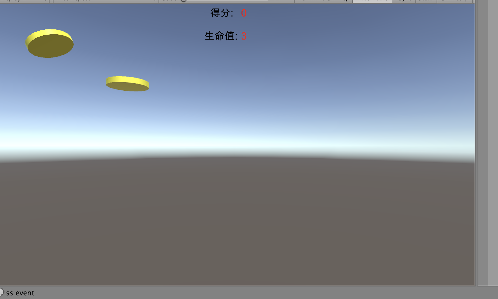
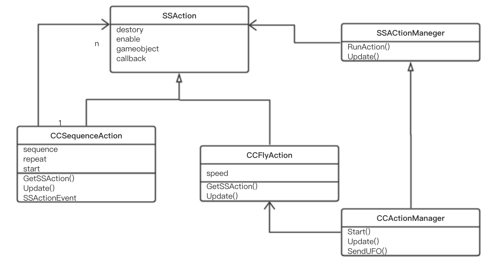
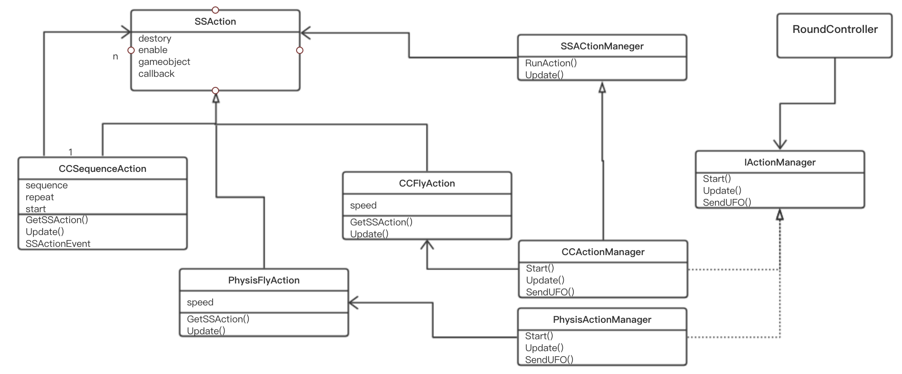

# 改进飞碟（Hit UFO）游戏：

## 游戏内容要求
- 按adapter模式 设计图修改飞碟游戏
- 使它同时支持物理运动与运动学（变换）运动



现在的需求是:
- 不想放弃 CCActionManager
- 新建 PhysisActionManager  

## adapter模式简介
适配器模式（Adapter）的定义如下：将一个类的接口转换成客户希望的另外一个接口，使得原本由于接口不兼容而不能一起工作的那些类能一起工作。适配器模式分为类结构型模式和对象结构型模式两种，前者类之间的耦合度比后者高，且要求程序员了解现有组件库中的相关组件的内部结构，所以应用相对较少些。

该模式的主要优点如下。
- 客户端通过适配器可以透明地调用目标接口。
- 复用了现存的类，程序员不需要修改原有代码而重用现有的适配者类。
- 将目标类和适配者类解耦，解决了目标类和适配者类接口不一致的问题。

其缺点是：对类适配器来说，更换适配器的实现过程比较复杂。

## 改进方法
管理物理运动和运动学运动的ActionManager的接口可能不同，因此定义一个新的接口IActionManager，使得RoundController能以同样的方式调用ActionManager。  

原设计图如下：


新的设计如下图:
  
组合模式中新增一个被组合对象PhysisAction用来实现物理运动。  
RoundController将使用接口IActionManager，
原先CCActionManager的和新增的PhysisActionManager都实现该接口。   
IActionManager就是运用了Adapter设计模式。  

其他类几乎不用修改就可以实现同时支持物理运动与运动学运动。  
## PhysisFlyAction类 实现物理运动
```cs
using System.Collections;
using System.Collections.Generic;
using UnityEngine;
 
public class PhysisFlyAction : SSAction {
    Vector3 speed;
    Vector3 gravity;
    Vector3 impluseForce;
    public static PhysisFlyAction GetSSAction(GameObject UFO)
    {
        PhysisFlyAction action = ScriptableObject.CreateInstance<PhysisFlyAction>();
        action.speed = UFO.GetComponent<UFOData>().speed;
        action.gravity=UFO.GetComponent<UFOData>().gravity;
        action.impluseForce = UFO.GetComponent<UFOData>().impulseForce;
        return action;
    }
	public override void Start () {
        gameobject.GetComponent<Rigidbody>().AddForce(gravity, ForceMode.Force);
        gameobject.GetComponent<Rigidbody>().AddForce(impluseForce, ForceMode.Impulse);
    }
 
    // Update is called once per frame
    public override void Update () {
        if (gameobject.activeSelf)
        {

            if (Mathf.Abs(this.transform.position.x) > 20 ||Mathf.Abs( this.transform.position.y) > 13)
            {
                this.destroy = true;
                //通知动作组合对象
                this.callback.SSActionEvent(this);

            }
        }
        else{
            this.callback.SSActionEvent(this);
        }
	}
}
```

## IActionManager接口
```cs
using UnityEngine;

public interface IActionManager
{
    void SendUFO(GameObject UFO);
}
```

## PhysisActionManager类 管理物理动作
```cs
using System.Collections;
using System.Collections.Generic;
using UnityEngine;

public class PhysisActionManager : SSActionManager, IActionManager
{
    public FirstController sceneController;

    public void Awake(){
        
    }
    protected  void Start()
    {
        sceneController = (FirstController)SceneDirector.GetInstance().CSController;
        sceneController.actionManager = this;
    }

    protected new void Update()
    {
        base.Update();
    }

    public void SendUFO(GameObject UFO)
    {
        PhysisFlyAction flyAction = PhysisFlyAction.GetSSAction(UFO);
        CSequenceAtion actions = CSequenceAtion.GetSSAcition(1, 0, new List<SSAction>{flyAction});
        this.RunAction(UFO, actions , this);
    }
}
```