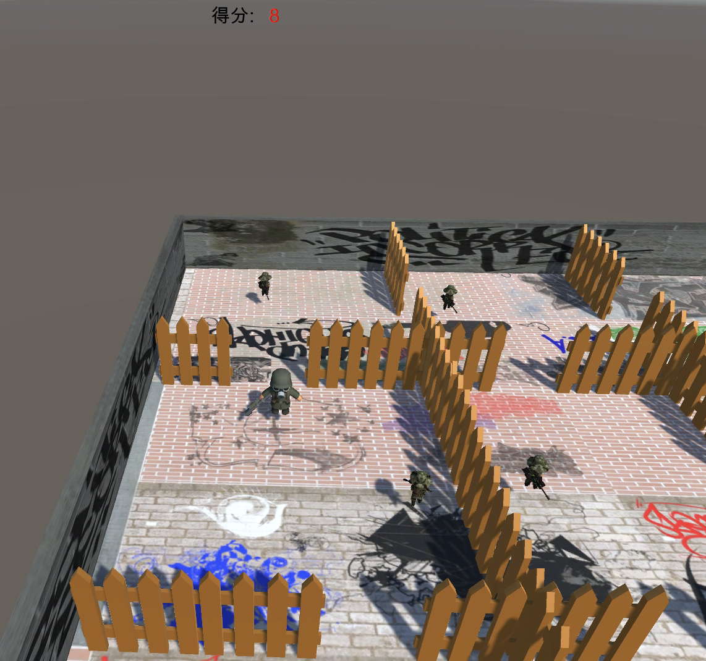
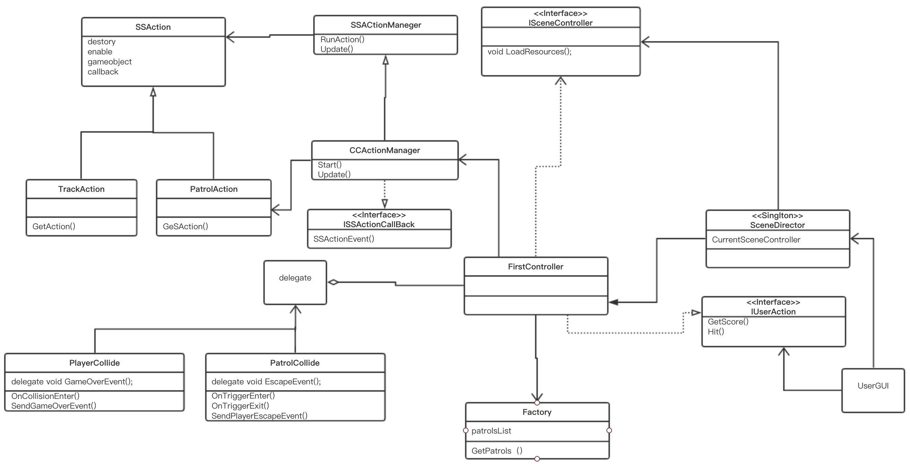

# 巡逻兵


游戏设计要求：
1. 创建一个地图和若干巡逻兵(使用动画)；
2. 每个巡逻兵走一个3~5个边的凸多边型，位置数据是相对地址。即每次确定下一个目标位置，用自己当前位置为原点计算；
3. 巡逻兵碰撞到障碍物，则会自动选下一个点为目标；
4. 巡逻兵在设定范围内感知到玩家，会自动追击玩家；
5. 失去玩家目标后，继续巡逻；
6. 计分：玩家每次甩掉一个巡逻兵计一分，与巡逻兵碰撞游戏结束；

程序设计要求：
- 必须使用订阅与发布模式传消息
- 工厂模式生产巡逻兵
  

点击下方图片观看视频演示
[](https://v.youku.com/v_show/id_XNDQxNDk5MjI5Ng==.html?spm=a2h3j.8428770.3416059.1)
## UML图



## 订阅与发布模式传消息
Subject：delegate  
Publisher：PatrolCollide,PlayerCollide   
Subscriber：FirstSceneController  

使用订阅发布者模式可以使FirstSceneController与碰撞检测解耦，碰撞后具体做什么由SceneController定义，当更改碰撞后处理逻辑时，不需要修改碰撞检测中的逻辑，因为碰撞检测调用统一的接口delegate。


事件由PatrolCollide,PlayerCollide 发布:  
 - EscapeEvent 玩家逃脱巡逻兵追击事件
 - GameOverEvent    玩家被巡逻兵追到后游戏结束事件

在碰撞检测中发布事件。
```cs
//Pubisher 1
public class PlayerCollide : MonoBehaviour
{
    //游戏结束事件代理
    public delegate void GameOverEvent();
    public static event GameOverEvent gameOverHandle;
    public void SendGameOverEvent()
    {
        if (gameOverHandle != null)
        {
            gameOverHandle();
        }
    }
    void OnCollisionEnter(Collision collider)
    {

        if (collider.gameObject.tag == "Player")
        {
           SendGameOverEvent();
        }
    }
}


//Publisher 2
public class PatrolCollide : MonoBehaviour
{
  //玩家逃脱巡逻兵追踪事件代理
    public delegate void EscapeEvent();
    public static event EscapeEvent escapeHandle;
    public void SendPlayerEscapeEvent()
    {
        if (escapeHandle != null)
        {
            escapeHandle();
        }
    }
    void OnTriggerEnter(Collider collider)
    {

        if (collider.gameObject.tag == "Player")
        {
            // Debug.Log("Trigger");
            this.gameObject.transform.parent.GetComponent<Animator>().SetBool("run",true);
            this.gameObject.transform.parent.GetComponent<PatrolInfo>().player=collider.gameObject;
            this.gameObject.transform.parent.GetComponent<PatrolInfo>().track=true;
            this.GetComponent<BoxCollider>().size=new Vector3(7,7,1);
        }
    }
    void OnTriggerExit(Collider collider)
    {
 
        if (collider.gameObject.tag == "Player")
        {
            Debug.Log("PatrollCollode: exit");
            this.gameObject.transform.parent. GetComponent<Animator>().SetBool("run",false);
            
            this.gameObject.transform.parent.GetComponent<PatrolInfo>().track = false;
            this.gameObject.transform.parent.GetComponent<PatrolInfo>().player = null;
            this.GetComponent<BoxCollider>().size=new Vector3(5,5,1);
            SendPlayerEscapeEvent();

        }
    }
}
```

在FirstSceneController定义函数处理事件:  
```cs
    void AddScore()
    {
        score++;
    }

    void GameOver()
    {
        gameState=GameState.gameOver;
        Destroy(player.GetComponent<JoyStick>());
    }
    void OnEnable()
    {
        PatrolCollide.escapeHandle += AddScore;
        PlayerCollide.gameOverHandle += GameOver;
    }
    void OnDisable()
    {
        PatrolCollide.escapeHandle -= AddScore;
        PlayerCollide.gameOverHandle -= GameOver;
    }
```


## 工厂模式生产巡逻兵 
```cs
public class Factory : MonoBehaviour
{
    private Vector3[] pos0 = new Vector3[9];            //巡逻兵开始巡逻的坐标
    private List<GameObject> patrolsList = new List<GameObject>();              
    private GameObject patrol = null;   
    
    public List<GameObject> GetPatrols()
    {
        int[] initPositionX = { 12, 2, -6 };
        int[] initPositionY = { 6, -4, -14 };
        for(int i=0;i < 9;i++)
        {
            pos0[i] = new Vector3(initPositionX[i/3], 0, initPositionY[i%3]);
        }
        for(int i=0; i < 9; i++)
        {
            patrol = Instantiate(Resources.Load<GameObject>("Prefabs/Patrol"));
            patrol.AddComponent<PatrolInfo>();
            patrol.gameObject.GetComponent<Collider>().enabled=true;
            patrol.transform.position = pos0[i];

            patrol.GetComponent<PatrolInfo>().area = i + 1;
            patrol.GetComponent<PatrolInfo>().start_position = pos0[i];
            patrolsList.Add(patrol);
        }   
        return patrolsList;
    }
}
```


## 巡逻兵动作(动作分离)  

追击动作
```cs
public class TrackAction : SSAction
{
    private float speed = 1.7f;            //跟随玩家的速度
    private GameObject player;           //玩家
    private PatrolInfo patrolInfo;       //侦查兵数据

    public static TrackAction GetSSAction(GameObject player)
    {
        TrackAction action = CreateInstance<TrackAction>();
        action.player = player;
        return action;
    }

    public override void Start()
    {
        patrolInfo = this.gameobject.GetComponent<PatrolInfo>();
    }
    public override void Update()
    {
        if (transform.localEulerAngles.x != 0 || transform.localEulerAngles.z != 0)
        {
            transform.localEulerAngles = new Vector3(0, transform.localEulerAngles.y, 0);
        }
        if (transform.position.y != 0)
        {
            transform.position = new Vector3(transform.position.x, 0, transform.position.z);
        }
         
        transform.position = Vector3.MoveTowards(this.transform.position, player.transform.position, speed * Time.deltaTime);
        this.transform.LookAt(player.transform.position);  
        if (!patrolInfo.track 
        || SSDirector.GetInstance().CurrentScenceController.GetPlayerArea() != patrolInfo.area)
        {
            this.destroy = true;
            this.callback.SSActionEvent(this,1,this.gameobject);
        }
    }
}
```

巡逻动作
```cs
public class PatrolAction : SSAction
{
    private enum Dirction { EAST, NORTH, WEST, SOUTH };

    int edge=0;                         //下次移动的边
    private Vector3 distination;        //多边形的定点坐标，作为每次移动的目的地坐标
    private float edgeLength=5;         //多边形的边长
    private float speed = 1.2f;        //移动速度
    private PatrolInfo patrolInfo; 
    
    public static PatrolAction GetSSAction(Vector3 location)
    {
        PatrolAction action = CreateInstance<PatrolAction>();
        action.distination = location;

        action.speed=Random.Range(0.8f, 1.8f);
        return action;
    }

    public override void Start()
    {
        this.gameobject.GetComponent<Animator>().SetBool("run", true);
        patrolInfo  = this.gameobject.GetComponent<PatrolInfo>();
    }
    
    public override void Update()
    {

        //防止碰撞发生后的旋转
        if (transform.localEulerAngles.x != 0 || transform.localEulerAngles.z != 0)
        {
            transform.localEulerAngles = new Vector3(0, transform.localEulerAngles.y, 0);
        }            
        if (transform.position.y != 0)
        {
            transform.position = new Vector3(transform.position.x, 0, transform.position.z);
        }
        this.transform.LookAt(distination);
        float distance = Vector3.Distance(transform.position, distination);
        transform.position = Vector3.MoveTowards(this.transform.position, distination, speed * Time.deltaTime);
        if (distance < 0.5)
        {
            edge = (edge+1)%4;
            switch(edge)
            {
                case 0:
                    distination.x+=edgeLength;
                    break;
                case 1:
                    distination.z+=edgeLength;
                    break;
                case 2:
                    distination.x-=edgeLength;
                    break;
                case 3:
                    distination.z-=edgeLength;
                    break;
            }
        }
        
        //如果侦察兵需要跟随玩家并且玩家就在侦察兵所在的区域，侦查动作结束
        if (patrolInfo.track 
        &&  SSDirector.GetInstance().CurrentScenceController.GetPlayerArea()== patrolInfo.area
        )
        {
            this.destroy = true;
            this.callback.SSActionEvent(this,0,this.gameobject);
        }
    }
}
```

## 键盘控制player
- Input.GetAxis()获取键盘输入，   
- 改变Player动画  
- transform.LookAt()使Player朝向按键方向
- 改变position使Player移动
    ```cs
    this.transform.position+=Vector3.forward*translationZ * speed * Time.deltaTime;

    this.transform.position+=Vector3.right*translationX * speed * Time.deltaTime;
    ```

```cs
public class JoyStick : MonoBehaviour
{
    float speed = 5f;
    // Start is called before the first frame update
    void Start()
    {        
    }

    // Update is called once per frame
    void Update()
    {
        float translationX = Input.GetAxis("Horizontal");
        float translationZ = Input.GetAxis("Vertical");
        // Debug.Log(translationX+" "+translationZ);
        {
            if (Mathf.Abs(translationX)>0.1||Mathf.Abs(translationZ)>0.1)
            {
                this.GetComponent<Animator>().SetBool("run", true);
            }
            else
            {
                this.GetComponent<Animator>().SetBool("run", false);
            }
            if(Mathf.Abs(translationX)>0.1||Mathf.Abs(translationZ)>0.1)
            { 
                Vector3 target = this.transform.position;
                target.x+=translationX*10;
                target.z+=translationZ*10;
                this.transform.LookAt(target);

                this.transform.position+=Vector3.forward*translationZ * speed * Time.deltaTime;
                this.transform.position+=Vector3.right*translationX * speed * Time.deltaTime;
            }
            //防止碰撞带来的移动
            if (this.transform.localEulerAngles.x != 0 || this.transform.localEulerAngles.z != 0)
            {
                this.transform.localEulerAngles = new Vector3(0, this.transform.localEulerAngles.y, 0);
            }
            if (this.transform.position.y != 0)
            {
                this.transform.position = new Vector3(this.transform.position.x, 0, this.transform.position.z);
            }     
        }
    }
}
```


## 场景控制器
- 调用工厂类加载游戏对象;   
- 为Player添加JoyStick组件;   
- 调用动作管理器执行动作;  
- 游戏开始、结束、计分等。
```cs
using System.Collections;
using System.Collections.Generic;
using UnityEngine;
using UnityEngine.SceneManagement;

public enum GameState{gameOver,playing};
public class FirstSceneController : MonoBehaviour, IUserAction, ISceneController
{
    public Factory patrol_factory;                             
    public CCActionManager action_manager;    
    public int playerArea = -1;                            
    public GameObject player;           
    public Camera main_camera;                              
    private List<GameObject> patrols;  
    public GameState gameState=GameState.playing;
    private int score = 0;
    void Awake()
    {
        SSDirector.GetInstance().CurrentScenceController = this;
    }

    void Start()
    {
        score=0;
        gameState=GameState.playing;

        patrol_factory = Singleton<Factory>.Instance;
        action_manager = gameObject.AddComponent<CCActionManager>() as CCActionManager;
        LoadResources();
        for (int i = 0; i < patrols.Count; i++)
            action_manager.GoPatrol(patrols[i]);
        main_camera.GetComponent<CameraFlow>().follow = player;
    }

    void Update()
    {
    }

    public void LoadResources()
    {
        Instantiate(Resources.Load<GameObject>("Prefabs/Plane"));
        player = Instantiate(Resources.Load("Prefabs/Player"), new Vector3(-1, 0, 2), Quaternion.identity) as GameObject;
        player.AddComponent<JoyStick>();
        player.GetComponent<Collider>().enabled=true;
        patrols = patrol_factory.GetPatrols();
    }

    public int GetPlayerArea()
    {
        return playerArea;
    }

    public void Restart()
    {

    }

    public GameState GetGameState()
    {
        return gameState;
    }

    public int GetScore()
    {
        return score;
    }

    void AddScore()
    {
        score++;
    }

    void GameOver()
    {
        gameState=GameState.gameOver;
        Destroy(player.GetComponent<JoyStick>());
    }
    void OnEnable()
    {
        PatrolCollide.escapeHandle += AddScore;
        PlayerCollide.gameOverHandle += GameOver;
    }
    void OnDisable()
    {
        PatrolCollide.escapeHandle -= AddScore;
        PlayerCollide.gameOverHandle -= GameOver;
    }
}
```

## UserGUI  
通过IUserAction接口获取游戏状态，将得分显示出来。
```cs
using System.Collections;
using System.Collections.Generic;
using UnityEngine;

public class UserGUI : MonoBehaviour
{
    private IUserAction action;

    //GUIstyle
    GUIStyle style1 = new GUIStyle();
    GUIStyle style2 = new GUIStyle(); 
    GUIStyle buttonStyle ;
    private bool gameStart = false;       //游戏开始

    void Start ()
    {
        action = SSDirector.GetInstance().CurrentScenceController as IUserAction;
        style1.normal.textColor = Color.black;
        style1.fontSize = 31;
        style2.normal.textColor = Color.red;
        style2.fontSize = 31;
        buttonStyle = new GUIStyle("button");
        buttonStyle.fontSize=29;
    }
	
	void OnGUI ()
    {
        GUI.Label(new Rect(Screen.width/2 - 74, 10, 150, 50), "得分:", style1);
        GUI.Label(new Rect(Screen.width/2 +20, 10, 220, 50), action.GetScore().ToString(), style2);
        //游戏结束
        if (action.GetGameState()==GameState.gameOver)
        {
            GUI.Label(new Rect(Screen.width / 2 - 96, Screen.height / 2 - 250, 150, 100), "Game Over!", style2);
            GUI.Label(new Rect(Screen.width / 2 - 76, Screen.height / 2 - 200, 150, 50), "得分:", style1);
            GUI.Label(new Rect(Screen.width / 2 +15, Screen.height / 2 - 200, 50, 50), action.GetScore().ToString(), style1);
            if (GUI.Button(new Rect(Screen.width / 2 - 85, Screen.height / 2 - 150, 130, 66), "重新开始",buttonStyle))
            {
                action.Restart();
            }
        }
    }

}
```