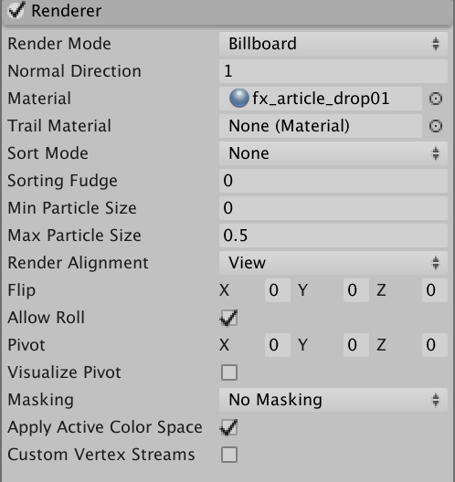

# 简单粒子制作  


  
这是由一个光晕粒子系统坐标随时间变化形成的四角型光环。


下面先制作光晕粒子系统：  
  


## 1、创建粒子系统  

首先创建一个粒子系统：GameObject -> Effects -> Particle System   
接下来调整粒子系统的参数。


## 2、Renderer  
渲染组件中，我们用已下载的材质设置Material。 
粒子使用的材质：    


勾选Cast Shadows和Receive Shadows。  


## 3、基本参数设置   
选择Looping，粒子循环发射。  
Prewarm使得开始时粒子就已经发射了一个周期。   
Simulation Space设置为World，这样粒子系统在移动时，粒子不会跟着移动。  
速率为0，因为光晕不动。


## 4、Emission  

只要调整发射速率即可。  


## 5、shape 
我们从一个点发射粒子，所以shape选择Sphere，半径接近0。


## 6、Size over Lifetime
粒子大小随其生命周期的变化。在光圈中，粒子是逐渐消失的，所以粒子大小逐渐减小。  

  

## 7、Texture Sheet Animation  
这个组件得配合Renderer组件的材质。因为我们的序列帧图片是从材质图中获取的。
我们将图分为2*2的四块。  光晕选择左下角的图，也就是2。  

  


## 8、星光  
再创建一个粒子系统，作为上面的子部件，用于发射星光。  
星光从中心向四周发射，逐渐变小并消失。  
参数如下所示：
  
  
  
  

## 9、光环脚本  
接下来只要编写脚本控制该粒子系统运动路线为四角环即可。
四角形的解析式：
$$\begin{cases}
x=a\,cos^3t\\
&& (a>0)\\
y=a\,sin^3t\\
    
\end{cases}
$$

```cs
public class move : MonoBehaviour
{
    // Start is called before the first frame update
    public GameObject particles;
    public float t = 0;
    public float a = 1;
    public float speed = 10;
    public float dt = 3;
    void Start()
    {     
    }
    void Update()
    {
        dt += Time.deltaTime;
        if (dt > 3 && dt <8)
        {
            a = 25;
        }
        else if (dt >8 && dt < 11)
        { 
            a = 8; 
        }
        else if (dt >11)
        {
            dt = 3;
        }
        t = Time.time * speed;
        float x = a * Mathf.Pow(Mathf.Cos(t), 3);
        float y = a * Mathf.Pow(Mathf.Sin(t), 3);
        particles.transform.position = new Vector3(y, x, 0);
    }
}
```

