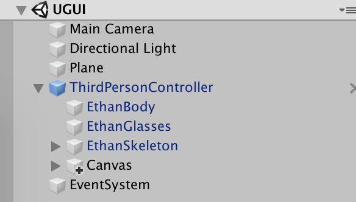
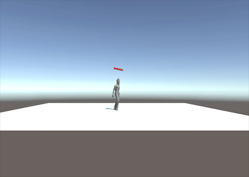
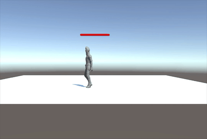
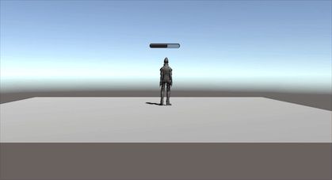

<!--
 * @Description: 
 * @Author: WangXinji
 * @Date: 2019-11-20 17:32:34
 * @LastEditTime: 2019-11-20 18:57:25
 * @LastEditors: WangXinji
 -->
# 血条制作

血条（Health Bar）的预制设计。具体要求如下
- 分别使用 IMGUI 和 UGUI 实现
- 使用 UGUI，血条是游戏对象的一个子元素，任何时候需要面对主摄像机
- 分析两种实现的优缺点
- 给出预制的使用方法

## 使用 UGUI 制作血条


- 菜单 Assets -> Import Package -> Characters 导入资源
- 在层次视图，Context 菜单 -> 3D Object -> Plane 添加 Plane 对象
- 资源视图展开 Standard Assets :: Charactors :: ThirdPersonCharater :: Prefab
- 将 ThirdPersonController 预制拖放放入场景

- 检查以下属性
  - Plane 的 Transform 的 Position = (0,0,0)
  - Ethan 的 Transform 的 Position = (0,0,0)
  - Main Camera 的 Transform 的 Position = (0,1,-10)

- 运行检查效果

- 选择 Ethan 用上下文菜单 -> UI -> Canvas, 添加画布子对象
- 选择 Ethan 的 Canvas，用上下文菜单 -> UI -> Slider 添加滑条作为血条子对象
- 运行检查效果
- 选择 Ethan 的 Canvas，在 Inspector 视图
- 设置 Canvas 组件 Render Mode 为 World Space
- 设置 Rect Transform 组件 (PosX，PosY，Width， Height) 为 (0,2,160,20)
- 设置 Rect Transform 组件 Scale （x,y） 为 (0.01,0.01)  
  
运行检查效果，应该是头顶 Slider 的 Ethan，用键盘移动 Ethan，观察  

- 展开 Slider
  - 选择 Handle Slider Area，禁灰（disable）该元素
  - 选择 Background，禁灰（disable）该元素
  - 选择 Fill Area 的 Fill，修改 Image 组件的 Color 为 红色
- 选择 Slider 的 Slider 组件
  - 设置 MaxValue 为 100
  - 设置 Value 为 75
  
运行检查效果，发现血条随人物旋转  



给 Canvas 添加以下脚本 LookAtCamera.cs  
```cs
using UnityEngine;

public class LookAtCamera : MonoBehaviour {

	void Update () {
		this.transform.LookAt (Camera.main.transform.position);
	}
}
```

运行检查效果,发现血条始终对着摄像机。



## 使用 IMGUI 制作血条  

将GUI.HorizontalScrollbar作为血条，改变size以改变血量。
```cs
public static float HorizontalScrollbar(Rect position, float value, float size, float leftValue, float rightValue);
```

给人物添加以下脚本 IMGUIHealthBar.cs
```cs
using UnityEngine;

public class IMGUIHealthBar : MonoBehaviour
{
    public float size=50f;

    void Start()
    {
    }
    void Update()
    {
    }
    void OnGUI()
    {
        Vector3 pos= Camera.main.WorldToScreenPoint(this.transform.position);
        if(size <=100)
            size += Time.deltaTime*3;
        
        GUI.HorizontalScrollbar(new Rect(pos.x-50,pos.y,100,20),  0,size,0f,100f);
    }
}
```
运行效果：  


## 优缺点对比  

### UGUI
UGUI 是面向对象的 UI 系统。所有 UI 元素都是游戏对象，友好的图形化设计界面， 可在场景渲染阶段渲染这些 UI 元素。  
优点：  
- 所见即所得（WYSIWYG）设计工具
- 支持多模式、多摄像机渲染
- 面向对象的编程
  
缺点：   
- 难以调试
### IMGUI  
优点：  
在修改模型，渲染模型这样的经典游戏循环编程模式中，在渲染阶段之后，绘制 UI 界面无可挑剔（参考Execution Order of Event Functions）。这样的编程即避免了 UI 元素保持在屏幕最前端，又有最佳的执行效率，一切控制掌握在程序员手中，这对早期计算和存储资源贫乏的游戏设备来说，更是弥足珍贵。

缺点：  
它是代码驱动的 UI 系统，没有图形化设计界面，只能在 OnGUI 阶段用 GUI 系列的类绘制各种 UI 元素，因此 UI元素只能浮在游戏界面之上。
IMGUI系统通常不打算用于玩家可能使用并与之交互的普通游戏内用户界面。
IMGUI 主要用于以下场景：
- 在游戏中创建调试显示工具
- 为脚本组件创建自定义的 Inspector 面板。
- 创建新的编辑器窗口和工具来扩展 Unity 环境。


## 预制使用方法  
- 将血条预制拖入角色下，作为角色的子对象  
- 调整Canvas的Rect Transform使之在角色头顶